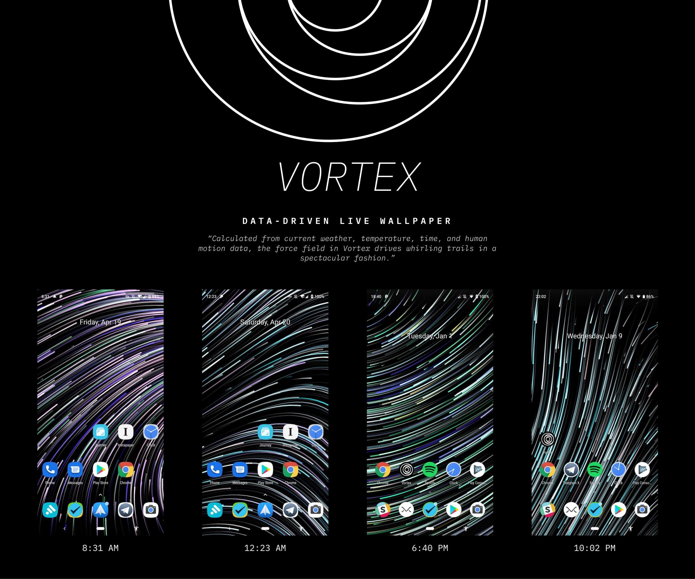

# Vortex
## Introduction
Vortex, a Data-driven Live Wallpaper ([Google Play](https://play.google.com/store/apps/details?id=com.justzht.vortex)), is an Unity-Android hybrid live wallpaper developed by [JustZht](https://fincher.im/). 
Based on data acquired from [Awareness API](https://developers.google.com/awareness/overview) including weather, location, time, human motion, Vortex manipulate the flowing particles with different parameters.

## Project Structure

## Build Instructions
